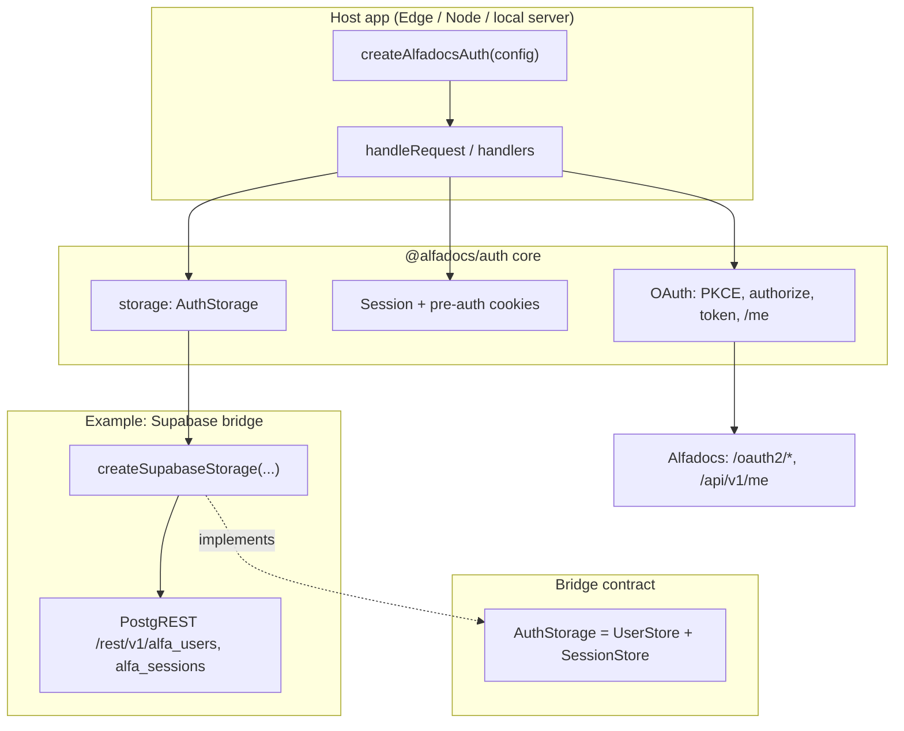

# @alfadocs/auth

Bridgeable Alfadocs auth core with infrastructure adapters.

## Architecture



The **core** owns the OAuth flow and cookies. **`AuthStorage`** is the persistence seam; **`createSupabaseStorage`** is one implementation (PostgREST only: `fetch`, no Postgres driver).

**Login flow:** browser → `handleLogin` (redirect) → Alfadocs → `handleCallback` (code exchange + profile) → storage upsert user + session → `Set-Cookie` → later `handleSession` uses cookie → `getSession` / `getUser`.

## Install

```bash
npm install @alfadocs/auth
```

## Supabase tables (one-time)

Tables **`alfa_users`** and **`alfa_sessions`** are **multi-tenant**: every row includes **`app_id`**. Primary keys are **`(app_id, id)`** and **`(app_id, cookie_value)`**. The bridge sets `app_id` from **`appId`** or, if omitted, from **`oauthClientId`** (Alfadocs OAuth **`client_id`**) on every PostgREST request.

**Breaking:** if you previously used the old **`alfadocs_auth_ensure_schema`** RPC, new migrations **`DROP FUNCTION IF EXISTS`** it. If you had tables **without** `app_id`, drop `alfa_sessions` then `alfa_users` before applying.

**Apply DDL:** use [`supabase/migrations/`](supabase/migrations/) — run **`supabase db push`** with the [Supabase CLI](https://supabase.com/docs/guides/cli), or paste the latest migration SQL into the [Supabase SQL editor](https://supabase.com/dashboard). That creates **`alfa_*`** in `public` and **`NOTIFY pgrst, 'reload schema'`** so PostgREST reloads.

**Shared auth project (e.g. Lovable / Edge):** one Supabase project can back many apps. Use **`AUTH_SUPABASE_URL`** and **`AUTH_SUPABASE_KEY`**. For the `app_id` row scope, pass **`appId`** (e.g. **`AUTH_APP_ID`**) and/or **`oauthClientId`** (your Alfadocs OAuth **`client_id`**). If **`appId`** is omitted, **`oauthClientId`** is used — fine when one OAuth client maps to one tenant. Prefer an explicit **`appId`** when several apps share the same `client_id` or you want a non-public identifier. **`createSupabaseStorage({ supabaseUrl, serviceRoleKey, appId?, oauthClientId? })`**. Treat the service role as a root secret.

**RLS:** the shipped migration enables **row level security** on **`alfa_*`** with **no policies** for normal roles, so **`anon` / `authenticated`** PostgREST traffic cannot read or write those rows (hardening if a key is misused). The **service role** used by this bridge **bypasses RLS** in Supabase, so your server-side `fetch` calls keep working. Add policies only if you intentionally expose these tables to user JWTs.

## Usage

```ts
import { createAlfadocsAuth } from "@alfadocs/auth";
import { createSupabaseStorage } from "@alfadocs/auth/supabase-bridge";

const auth = createAlfadocsAuth({
  clientId: "...",
  clientSecret: "...",
  redirectUri: "...",
  appOrigin: "https://myapp.example",
  storage: createSupabaseStorage({
    supabaseUrl: process.env.AUTH_SUPABASE_URL!,
    serviceRoleKey: process.env.AUTH_SUPABASE_KEY!,
    oauthClientId: process.env.ALFADOCS_CLIENT_ID!,
    // Optional override: appId: process.env.AUTH_APP_ID,
  }),
});
```

`auth.handleRequest(req)` routes:
- `OPTIONS <any-path>` -> CORS preflight
- `GET /login` -> start OAuth login
- `GET /callback` -> callback exchange + user/session persistence
- `GET /session` -> session check
- `POST /logout` -> logout (origin-checked, cookie clear + session invalidation)

## Storage interfaces

The core is now decoupled from infrastructure via split interfaces:
- `UserStore` (`getUser`, `createUser(userId, username, authData)`, `updateUser`)
- `SessionStore` (`createSession`, `getSession`, `deleteSession`)
- `AuthStorage` (`UserStore & SessionStore`)

The bridge only speaks **PostgREST** (`fetch`), so it runs on **Supabase Edge**, Deno Deploy, Bun, Node, and Cloudflare Workers without a `postgres` driver.

## Testing

**Unit tests** (Vitest), from the repo root:

```bash
npm test
```

**Deno smoke test** (loads the Supabase bridge under Deno with stubbed `fetch`):

```bash
npm run test:deno
```

This runs `deno test tests/deno/` with repo [`deno.json`](deno.json) enabling sloppy imports so Node-style `.js` specifiers in `src/` resolve to `.ts` sources under Deno.

Tests live under `tests/core/`, `tests/supabase-bridge/`, and `tests/deno/`.

**Local end-to-end smoke test** against a real Alfadocs client and Supabase project (no Edge Function required): build, configure env, run the sample server.

```bash
npm run local:test-app
```

Create `tests/local-app/.env` with the variables listed there (or export them in your shell). Full steps and troubleshooting: [tests/local-app/README.md](tests/local-app/README.md).
