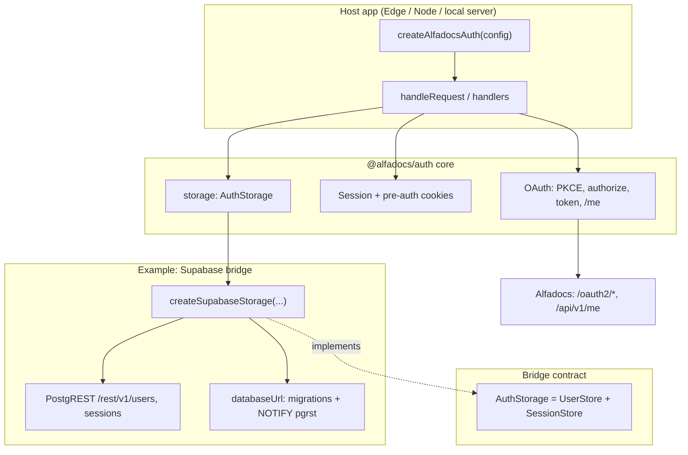

# @alfadocs/auth

Bridgeable Alfadocs auth core with infrastructure adapters.

## Architecture



The **core** owns the OAuth flow and cookies. **`AuthStorage`** is the persistence seam; **`createSupabaseStorage`** is one implementation (REST + optional Postgres migrations).

**Login flow:** browser → `handleLogin` (redirect) → Alfadocs → `handleCallback` (code exchange + profile) → storage upsert user + session → `Set-Cookie` → later `handleSession` uses cookie → `getSession` / `getUser`.

## Install

```bash
npm install @alfadocs/auth
```

## Usage

```ts
import { createAlfadocsAuth } from "@alfadocs/auth";
import { createSupabaseStorage } from "@alfadocs/auth/supabase-bridge";

const auth = createAlfadocsAuth({
  clientId: "...",
  clientSecret: "...",
  redirectUri: "...",
  appOrigin: "https://myapp.example",
  storage: createSupabaseStorage({
    supabaseUrl: process.env.SUPABASE_URL!,
    serviceRoleKey: process.env.SUPABASE_SERVICE_ROLE_KEY!,
    databaseUrl: process.env.SUPABASE_DB_URL!,
  }),
});
```

`auth.handleRequest(req)` routes:
- `OPTIONS <any-path>` -> CORS preflight
- `GET /login` -> start OAuth login
- `GET /callback` -> callback exchange + user/session persistence
- `GET /session` -> session check
- `POST /logout` -> logout (origin-checked, cookie clear + session invalidation)

## Storage interfaces

The core is now decoupled from infrastructure via split interfaces:
- `UserStore` (`getUser`, `createUser(userId, username, authData)`, `updateUser`)
- `SessionStore` (`createSession`, `getSession`, `deleteSession`)
- `AuthStorage` (`UserStore & SessionStore`)

## Supabase optimistic migrations

The Supabase bridge uses an optimistic strategy:
1. Assume `users` and `sessions` tables already exist.
2. If an operation fails with a missing-table error, run bridge migrations automatically.
3. Retry the operation after migration (with short backoff for schema cache refresh).

Migration SQL files:
- `src/supabase-bridge/migrations/001_create_users.sql`
- `src/supabase-bridge/migrations/002_create_sessions.sql`

Note: automatic migration requires `databaseUrl` credentials that can execute SQL in your Supabase project.

## Testing

**Unit tests** (Vitest), from the repo root:

```bash
npm test
```

Tests live under `tests/core/` and `tests/supabase-bridge/`.

**Local end-to-end smoke test** against a real Alfadocs client and Supabase project (no Edge Function required): build, configure env, run the sample server.

```bash
npm run local:test-app
```

Create `tests/local-app/.env` with the variables listed there (or export them in your shell). Full steps and troubleshooting: [tests/local-app/README.md](tests/local-app/README.md).
