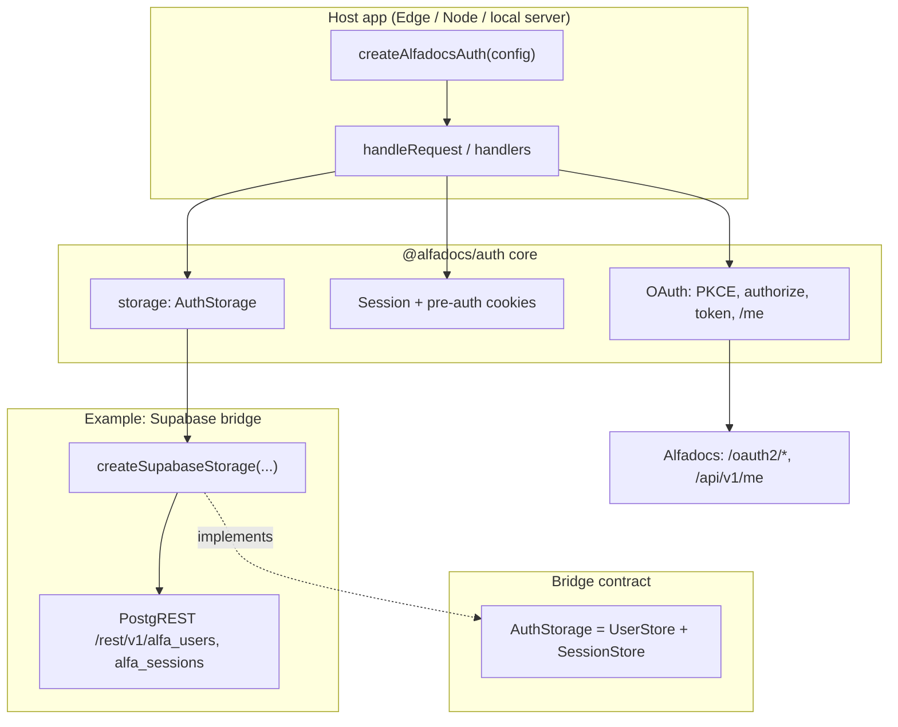

# @alfadocs/auth

Bridgeable Alfadocs auth core with infrastructure adapters.

## Architecture



The **core** owns the OAuth flow and cookies. **`AuthStorage`** is the persistence seam; **`createSupabaseStorage`** is one implementation (PostgREST only: `fetch`, no Postgres driver).

**Login flow:** browser → `handleLogin` (redirect) → Alfadocs → `handleCallback` (code exchange + profile) → storage upsert user + session → `Set-Cookie` → later `handleSession` uses cookie → `getSession` / `getUser`.

## Install

```bash
npm install @alfadocs/auth
```

## Supabase tables (one-time)

Tables **`alfa_users`** and **`alfa_sessions`** are **multi-tenant**: every row includes **`app_id`**. Primary keys are **`(app_id, id)`** and **`(app_id, cookie_value)`**. The bridge sets `app_id` from **`appId`** or, if omitted, from **`oauthClientId`** (Alfadocs OAuth **`client_id`**) on every PostgREST request.

**Breaking:** if you previously used the old **`alfadocs_auth_ensure_schema`** RPC, new migrations **`DROP FUNCTION IF EXISTS`** it. If you had tables **without** `app_id`, drop `alfa_sessions` then `alfa_users` before applying.

**Apply DDL:** use [`supabase/migrations/`](supabase/migrations/) — run **`supabase db push`** with the [Supabase CLI](https://supabase.com/docs/guides/cli), or paste the latest migration SQL into the [Supabase SQL editor](https://supabase.com/dashboard). That creates **`alfa_*`** in `public` and **`NOTIFY pgrst, 'reload schema'`** so PostgREST reloads.

**Shared auth project (e.g. one central Supabase used by several deployed apps):** one Supabase project can back many apps. Use **`AUTH_SUPABASE_URL`** and **`AUTH_SUPABASE_KEY`**. For the `app_id` row scope, pass **`appId`** (e.g. **`AUTH_APP_ID`**) and/or **`oauthClientId`** (your Alfadocs OAuth **`client_id`**). If **`appId`** is omitted, **`oauthClientId`** is used — fine when one OAuth client maps to one tenant. Prefer an explicit **`appId`** when several apps share the same `client_id` or you want a non-public identifier. **`createSupabaseStorage({ supabaseUrl, serviceRoleKey, appId?, oauthClientId? })`**. Treat the service role as a root secret.

**RLS:** the shipped migration enables **row level security** on **`alfa_*`** with **no policies** for normal roles, so **`anon` / `authenticated`** PostgREST traffic cannot read or write those rows (hardening if a key is misused). The **service role** used by this bridge **bypasses RLS** in Supabase, so your server-side `fetch` calls keep working. Add policies only if you intentionally expose these tables to user JWTs.

## App Supabase vs auth Supabase (don’t mix keys)

Many apps already have a **Supabase project** for product data (often with the **`anon`** key in the browser and **`SUPABASE_URL`** in env). **`createSupabaseStorage`** is separate: it talks to the project where **`alfa_users`** / **`alfa_sessions`** live.

| | **Your app’s Supabase** (typical) | **Auth storage Supabase** (`createSupabaseStorage`) |
|--|--|--|
| **Purpose** | Your tables, RLS, maybe Supabase Auth for end users | Only Alfadocs session + user rows for this library |
| **URL env** | Often `SUPABASE_URL`, `VITE_SUPABASE_URL`, etc. | Use **`AUTH_SUPABASE_URL`** (or pass that string as `supabaseUrl`) |
| **Key** | Often **`anon`** in clients; server may use **service role** for admin jobs | Must be **service role** JWT for the **same project as `AUTH_SUPABASE_URL`** — set as **`AUTH_SUPABASE_KEY`** |
| **Safe in browser?** | `anon` only | **Never** — service role bypasses RLS |

**Common mistake:** pasting the app project’s **anon** key or **wrong project’s** service role into `createSupabaseStorage` → 401/404 on `alfa_*`, data missing, or writes to the wrong database. The URL and service role **must both** come from the project that actually has **`alfa_users`** / **`alfa_sessions`** (or from your dedicated central auth project).

Using **one** Supabase project for both app data and Alfadocs auth is fine **on purpose** — still use **`AUTH_SUPABASE_URL`** / **`AUTH_SUPABASE_KEY`** in code for the bridge so env names stay unambiguous.

## Usage

```ts
import { createAlfadocsAuth } from "@alfadocs/auth";
import { createSupabaseStorage } from "@alfadocs/auth/supabase-bridge";

const auth = createAlfadocsAuth({
  clientId: "...",
  clientSecret: "...",
  redirectUri: "...",
  appOrigin: "https://myapp.example",
  storage: createSupabaseStorage({
    // Must be the project where alfa_users / alfa_sessions exist (see table above).
    supabaseUrl: process.env.AUTH_SUPABASE_URL!,
    serviceRoleKey: process.env.AUTH_SUPABASE_KEY!,
    oauthClientId: process.env.ALFADOCS_CLIENT_ID!,
    // Optional override: appId: process.env.AUTH_APP_ID,
  }),
});
```

`auth.handleRequest(req)` routes:
- `OPTIONS <any-path>` -> CORS preflight
- `GET /login` -> start OAuth login
- `GET /callback` -> callback exchange + user/session persistence
- `GET /session` -> session check
- `POST /logout` -> logout (origin-checked, cookie clear + session invalidation)

## Host integration checklist (Supabase Edge + BFF)

End-to-end notes for running **`createAlfadocsAuth`** on **Supabase Edge Functions** behind a SPA that talks to **cookie-authenticated BFFs**. Adapt names (function slug, env vars, flags) to your stack.

### 1. Two Supabase surfaces (keep keys straight)

| Role | Typical env on the Edge runtime | Used for |
|------|----------------------------------|----------|
| **App project** | `SUPABASE_URL`, `SUPABASE_SERVICE_ROLE_KEY` | Your product schema, optional legacy Supabase Auth, any tables you touch from **`resolveProfile`** |
| **Auth storage project** | `AUTH_SUPABASE_URL`, `AUTH_SUPABASE_KEY` (service role) | Only `alfa_users` / `alfa_sessions` via `createSupabaseStorage` |

The **Alfadocs auth Edge function** often needs **both**: the bridge uses **`AUTH_*`**, while **`resolveProfile`** (below) commonly uses the Supabase client against the **app** project to persist tenant/user rows after `/me`.

Apply the multi-tenant **`alfa_*`** DDL to whichever project **`AUTH_SUPABASE_URL`** points at (see [Supabase tables](#supabase-tables-one-time) above).

### 2. Alfadocs auth Edge function (Deno)

- **Imports:** Deno can load this package from ESM in the function bundle, e.g.  
  `https://esm.sh/gh/alfadocs/auth@main/src/index.ts` and  
  `.../src/supabase-bridge/index.ts` (**pin a tag or commit** for production).
- **`redirectUri`:** the function’s public callback URL, e.g.  
  `{SUPABASE_URL}/functions/v1/<your-auth-function>/callback`  
  Register that exact URL in the AlfaDocs OAuth client.
- **`verify_jwt`:** set **`false`** for this function in `supabase/config.toml` if the gateway would otherwise require a Supabase JWT before the Alfadocs cookie exists.

**Path prefix:** `handleRequest` expects paths like `/login`, `/callback`. Many hosts prefix the URL (e.g. `/functions/v1/<name>/...`). Strip the prefix and build a **`new Request(innerPath + search, …)`** before `auth.handleRequest`, or routes will not match.

### 3. `appOrigin` for top-level navigations

The library scopes CORS, cookies, and redirects to **`appOrigin`**. That breaks down when:

- **`GET /login`** is a **top-level navigation** (often no `Origin` header).
- **`/callback`** is hit by the IdP redirect without your SPA’s origin.

A robust pattern:

1. Derive a candidate origin from a **trusted** `app_origin` query param (set by your SPA), then **`Origin`**, then **`Referer`** — each checked against an **explicit allowlist** (fixed production/staging URLs, preview hosts you control, localhost, etc.).
2. On **`GET /login`**, set a short-lived **`Set-Cookie: alfa_app_origin=…`** (Secure, `SameSite=None`) so **`/callback`** can read back the same origin when headers are absent.

Example login URL from the client:

`{PUBLIC_SUPABASE_URL}/functions/v1/<your-auth-function>/login?app_origin={encodeURIComponent(window.location.origin)}`

### 4. `resolveProfile`: `/me` → your domain model

Whatever **`resolveProfile`** returns is stored in **`alfa_users.auth_data`** and surfaced on **`GET /session`**. Typical uses:

- Use **`accessToken`**, **`meUrl`**, and **`fetchImpl`** to read AlfaDocs **`/me`** (and any follow-up API calls you need).
- Upsert rows in **your app database** (tenants, users, token vault tables, etc.).
- Return the fields your BFF and SPA need (stable tenant id, display name, internal foreign keys) so one session read avoids extra lookups.

You can keep **`auth_data`** minimal and resolve more server-side if you prefer.

### 5. BFFs and the session cookie

If the browser does **not** hold a Supabase user JWT (cookie-only Alfadocs session), client-side PostgREST with RLS is usually not the primary path. Instead:

- Expose a **BFF** Edge function (POST/GET as you design) that calls a small **`resolveSession(req)`** helper: parse **`alfadocs_session`**, use **`createSupabaseStorage`** with **`AUTH_*`** and **`oauthClientId`** to **`getSession` / `getUser`**, then read your claims from **`user.authData`**.
- Call those endpoints with **`fetch(..., { credentials: "include" })`** so the HttpOnly session cookie is sent to the **same Supabase project origin** that issued it (`/functions/v1/...`).

Set **`verify_jwt: false`** on BFF functions that rely on the Alfadocs cookie, and perform auth inside the handler — otherwise the gateway or CORS behavior can block credentialed calls.

**CORS:** with credentials, echo **`Access-Control-Allow-Origin: <request Origin>`** for allowed origins only — never **`*`**. Reuse the same allowlist you use for **`appOrigin`**.

Any Edge function that previously authenticated with **`Authorization: Bearer <supabase_jwt>`** needs a parallel path: same cookie session resolution, or an internal call to your BFF.

### 6. Sliding session (optional)

You can re-issue the **`alfadocs_session`** cookie on successful **`GET /session`** with a renewed **`Max-Age`** so active users stay signed in without forking the library.

### 7. Client routing and claims

- Use a **feature flag** or build-time env to choose “legacy Supabase Auth login URL” vs “Alfadocs auth function login URL”.
- UI and data hooks that today read **JWT `app_metadata` / claims** should branch: in cookie mode, load identity and tenant scope from your BFF (backed by **`auth_data`**).

### 8. Edge secrets checklist

On the **app** project (or wherever the Alfadocs auth + BFF functions run), set at least:

- **`ALFADOCS_CLIENT_ID`**, **`ALFADOCS_CLIENT_SECRET`**
- **`AUTH_SUPABASE_URL`**, **`AUTH_SUPABASE_KEY`**
- **`SUPABASE_URL`**, **`SUPABASE_SERVICE_ROLE_KEY`**

Add **`scopes`** on **`createAlfadocsAuth`** only if your product calls AlfaDocs APIs that require them.

---

**TL;DR:** Create **`alfa_*`** on the auth Supabase project → deploy an Edge wrapper with **path rewrite** and **`verify_jwt: false`** → **allowlist** `appOrigin` + optional **`alfa_app_origin`** cookie → implement **`resolveProfile`** for your schema → add **cookie-aware BFFs** that share one session resolver → point the SPA login at **`/functions/v1/<your-auth-function>/login`** and use **`credentials: "include"`** for API calls.

## Storage interfaces

The core is now decoupled from infrastructure via split interfaces:
- `UserStore` (`getUser`, `createUser(userId, username, authData)`, `updateUser`)
- `SessionStore` (`createSession`, `getSession`, `deleteSession`)
- `AuthStorage` (`UserStore & SessionStore`)

The bridge only speaks **PostgREST** (`fetch`), so it runs on **Supabase Edge**, Deno Deploy, Bun, Node, and Cloudflare Workers without a `postgres` driver.

## Testing

**Unit tests** (Vitest), from the repo root:

```bash
npm test
```

**Deno smoke test** (loads the Supabase bridge under Deno with stubbed `fetch`):

```bash
npm run test:deno
```

This runs `deno test tests/deno/` with repo [`deno.json`](deno.json) enabling sloppy imports so Node-style `.js` specifiers in `src/` resolve to `.ts` sources under Deno.

Tests live under `tests/core/`, `tests/supabase-bridge/`, and `tests/deno/`.

**Local end-to-end smoke test** against a real Alfadocs client and Supabase project (no Edge Function required): build, configure env, run the sample server.

```bash
npm run local:test-app
```

Create `tests/local-app/.env` with the variables listed there (or export them in your shell). Full steps and troubleshooting: [tests/local-app/README.md](tests/local-app/README.md).
